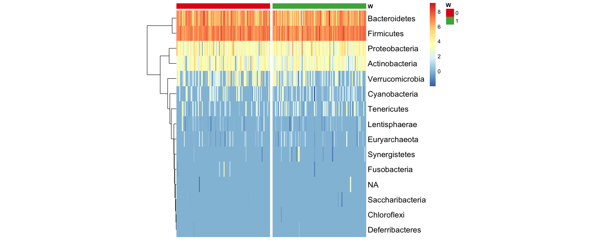
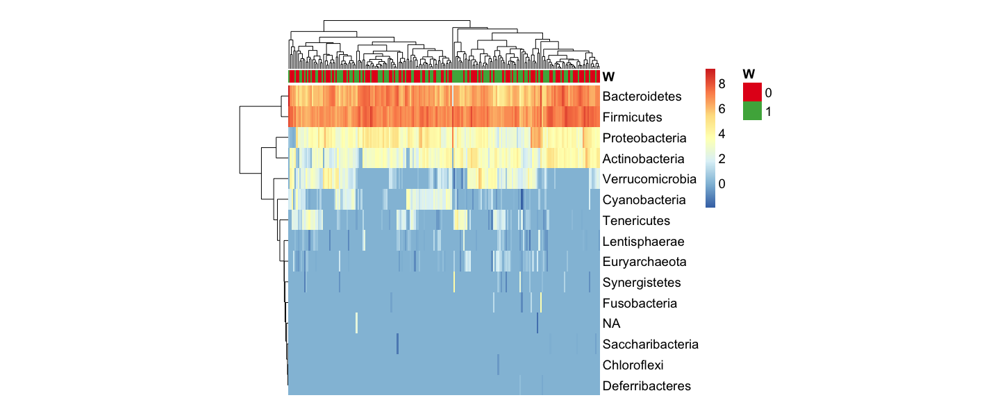
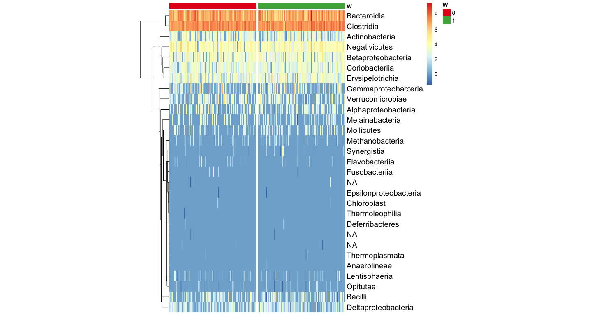
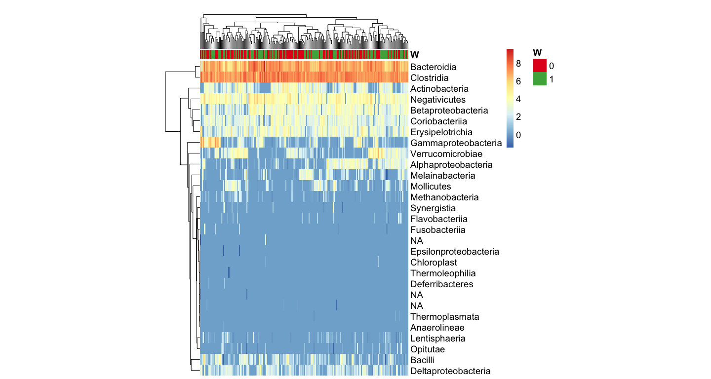
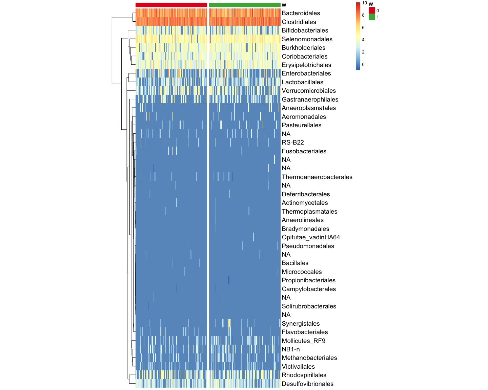
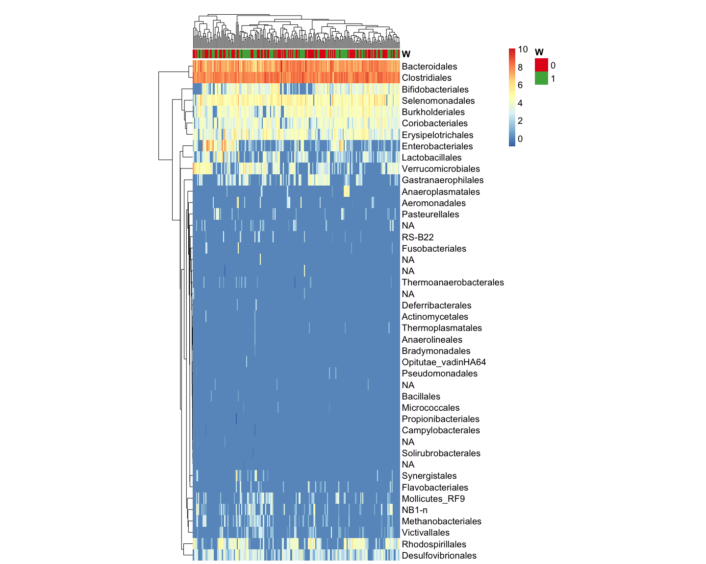
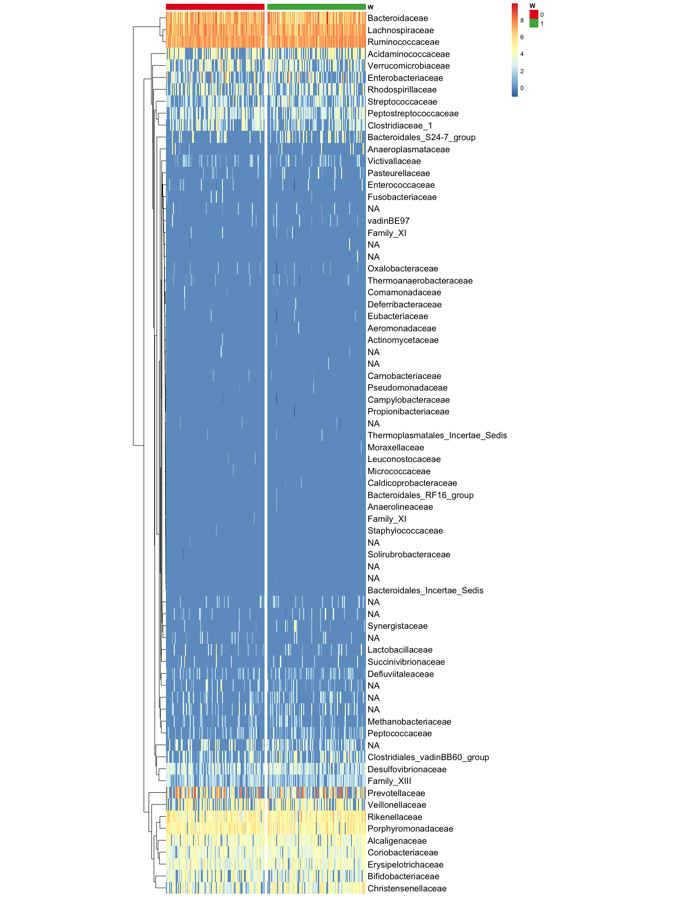
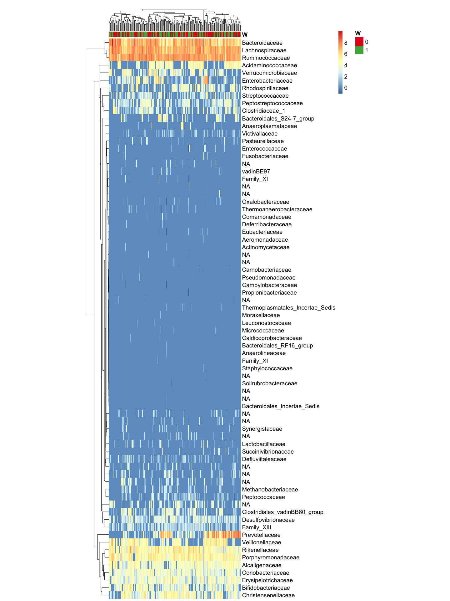
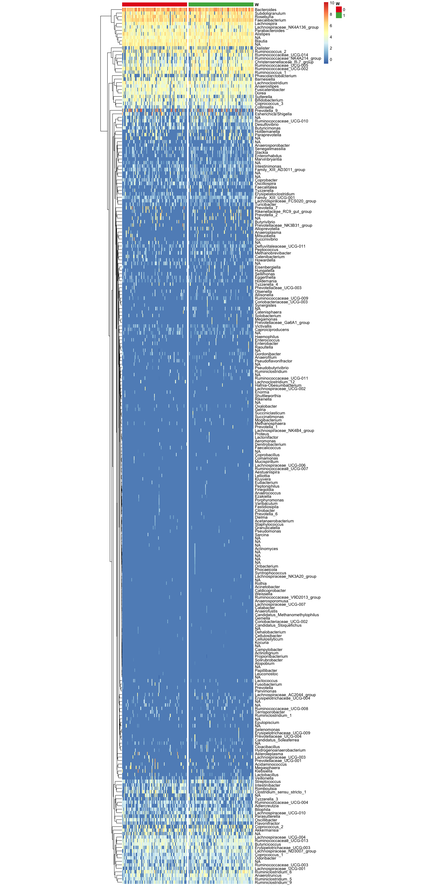
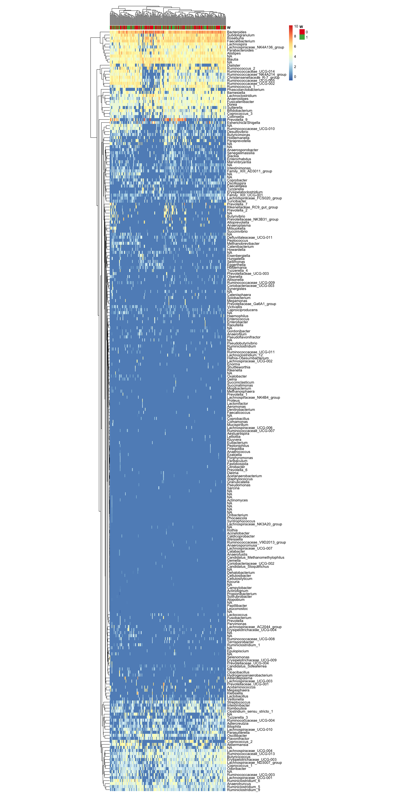

pheatmaps
================

``` r
library(phyloseq)
library(compositions)
library(pheatmap)
library(RColorBrewer)
```

### Load phyloseq data and air pollution samples

``` r
# set working directory
setwd('/Users/alicesommer/Desktop/Bureau/DOCTORATE')
# load microbiome data
ASV_table <- readRDS('data_pipeline_microbiome/dada2output/seqtab2020.rds')
taxon_assign <- readRDS('data_pipeline_microbiome/dada2output/taxa2020.rds')

# load sample/matched_data
load('data_pipeline_microbiome/dat_matched_PM25_bis.RData')

sample_df <- matched_df[order(matched_df$ff4_prid),]
sample_df$W <- as.factor(sample_df$W)
samples.out <- as.character(sample_df$ff4_prid)
rownames(sample_df) <- samples.out

# create a phyloseq object
ps <- phyloseq(otu_table(ASV_table, taxa_are_rows=FALSE),
               sample_data(sample_df),
               tax_table(taxon_assign))
ps
```

    ## phyloseq-class experiment-level object
    ## otu_table()   OTU Table:         [ 15801 taxa and 198 samples ]
    ## sample_data() Sample Data:       [ 198 samples by 2315 sample variables ]
    ## tax_table()   Taxonomy Table:    [ 15801 taxa by 7 taxonomic ranks ]

``` r
# remove the ASVs never observed in the matched samples
vec_taxa <- apply(otu_table(ps), 2, function(x) sum(x > 0, na.rm = TRUE))
ps <- prune_taxa(vec_taxa > 0, ps)
```

## Phylum level

<!-- -->

<!-- -->

## Class level

<!-- -->

<!-- -->

## Order level

<!-- -->

<!-- -->

## Family level

<!-- -->

<!-- -->

## Genus level

<!-- -->

<!-- -->
