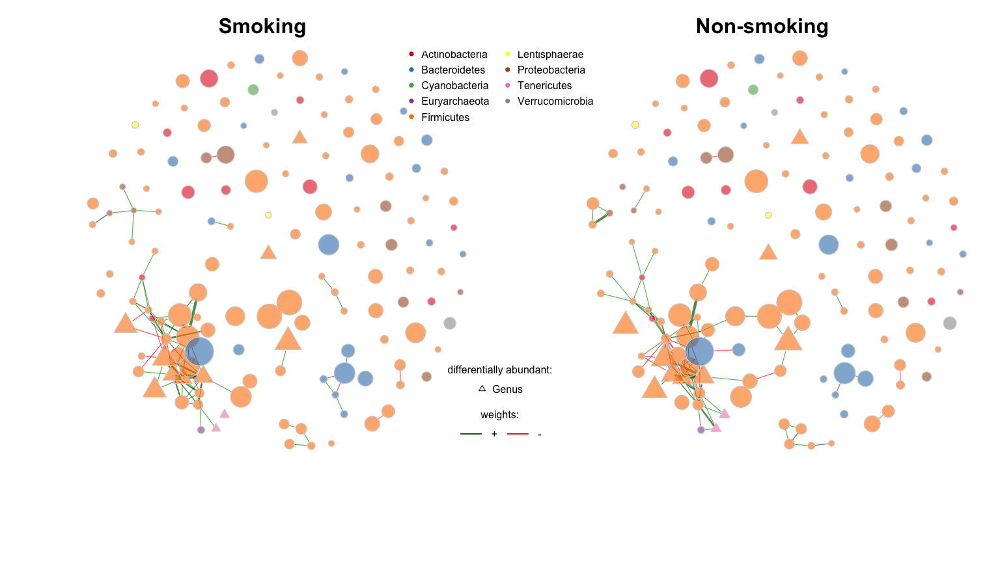
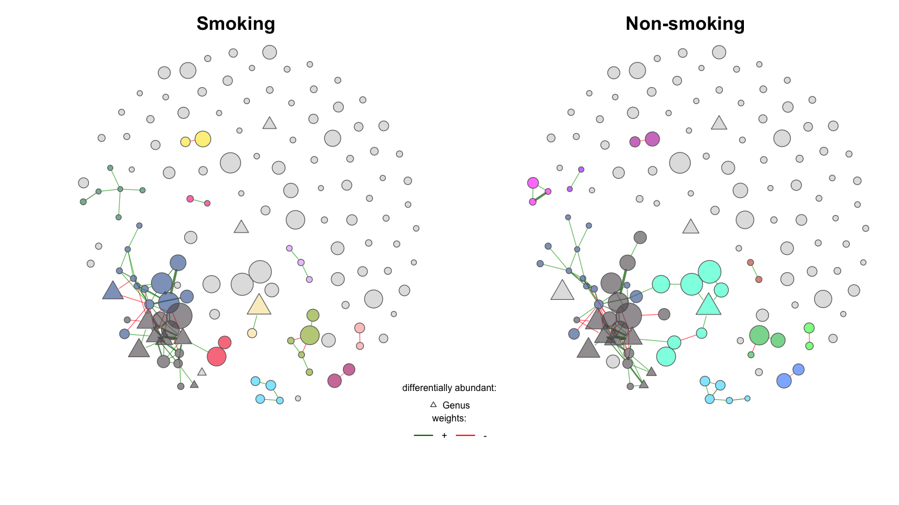
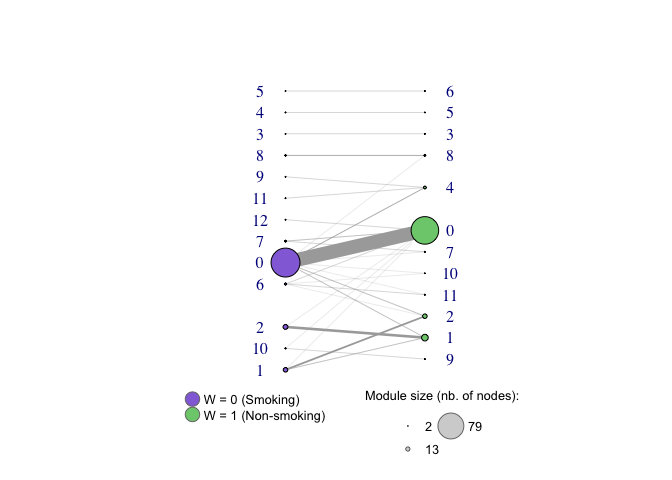
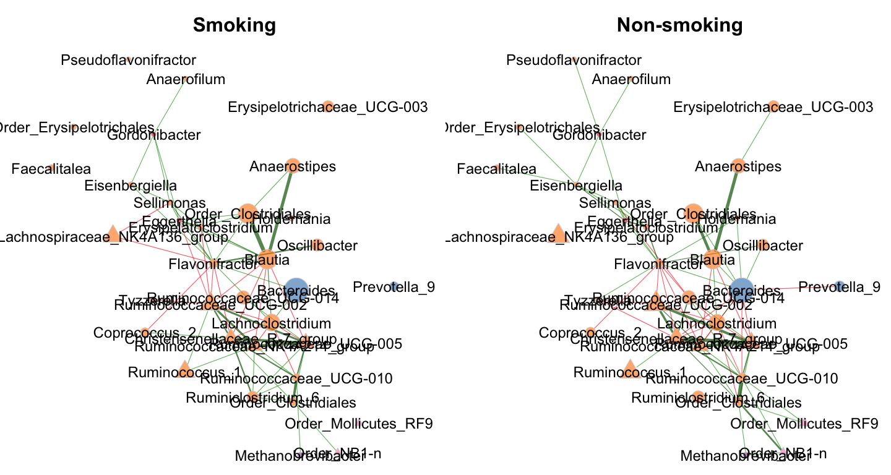
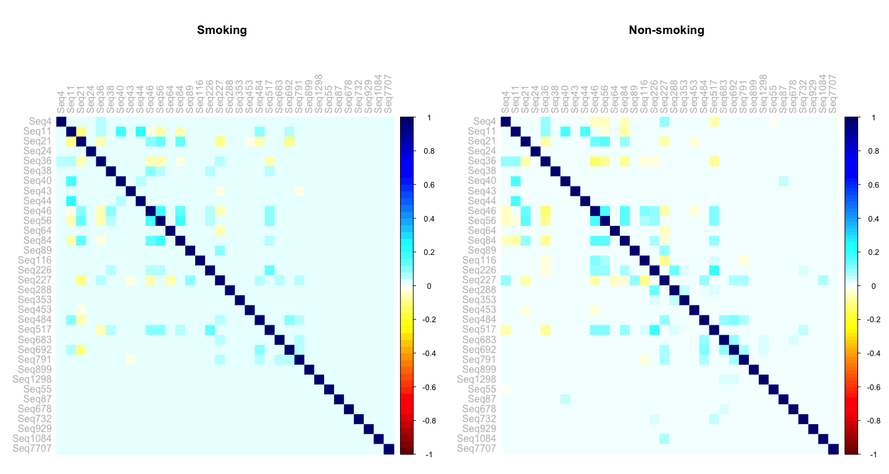

Networks viz Genus (smoking)
================

## NetCoMi

For more details on using the NetCoMi package see
<https://github.com/stefpeschel/NetCoMi>.

## Networks comparison

The following code was run on a cluster.

``` r
# # load phyloseq data
# load('/n/home05/ajsommer/NetCoMi_cluster/ps_to_net_Gen_smoke.RData')

# gut_split <- metagMisc::phyloseq_sep_variable(ps_Genus_prune, "W")

# net_W <- netConstruct(gut_split$`0`, gut_split$`1`, verbose = 2,
# filtTax = "highestVar",
# filtTaxPar = list(highestVar = 50),
#                            measure = "spieceasi",
#                           measurePar = list(method = "glasso",
#                                             nlambda=20,
#                                             pulsar.params=list(rep.num=50)),
#                           normMethod = "none", zeroMethod = "none",
#                           sparsMethod = "none", seed = 123456, matchDesign = c(1,1))

# load('/Users/alicesommer/Desktop/NetCoMi_cluster/net_W_output_Gen_smoke_Oct.RData')
# props_W <- netAnalyze(net_W, clustMethod = "cluster_fast_greedy", connectivity = FALSE)
## get errorn !!!!: Error in if (nrow(adjmatrix) != ncol(adjmatrix)) { : argument is of length zero
```

``` r
load('/Users/alicesommer/Desktop/DACOMP_cluster/dacomp_results/dacomp_results_smoke.RData')
condition <- dacomp_results$p_value_adj[dacomp_results$rank == "Genus"] <= 0.2
```

``` r
# layout union of networks
graph1 <- graph_from_adjacency_matrix(props_W$input$adjaMat1, weighted = TRUE)
graph2 <- graph_from_adjacency_matrix(props_W$input$adjaMat2, weighted = TRUE)

graph_u <- union(graph1, graph2)
### weight
E(graph_u)$weight <- pmin(E(graph_u)$weight_1, E(graph_u)$weight_2, na.rm = TRUE) # element-wise min. 
graph_u <- delete_edge_attr(graph_u, "weight_1")
graph_u <- delete_edge_attr(graph_u, "weight_2")

set.seed(40)
layout_fr <- layout_with_fr(graph_u, weights = E(graph_u)$weight)
# layout_fr <- layout.forceatlas2(graph_u, iterations=500, plotstep=500,
#                                 gravity = .5, k = 800)

plot_net_u <- props_W
plot_net_u$input$adjaMat1 <- as_adjacency_matrix(graph_u, attr="weight", sparse = FALSE)
```

<!-- -->

We plot the results of the netAnalyze function.

``` r
plot_props <- plot(props_W, 
     layout = layout_fr,
     # sameLayout = TRUE, layoutGroup = 1, 
     labels = FALSE,
     nodeColor = "colorVec",
     colorVec = phylcol_names,
     nodeTransp = 40,
     borderCol = "lightgray", highlightHubs = FALSE, 
     nodeSize = "clr", cexNodes = 1, 
     cexTitle = 2,
     edgeTranspLow = 30, 
     edgeTranspHigh = 30,
     nodeShape = c("circle", "triangle"),
     featVecShape = shapeVec,
     # rmSingles = "inboth",
     mar = c(6,5,3,2), groupNames = c("Smoking", "Non-smoking"))
legend("top", 
       inset = .04, title = "phylum:",
       legend=levels(phyl_ps_prune), ncol = 2,
       col=phylcol, pt.bg = phylcol, bty = "n", pch=16) 
legend("bottom", 
       inset = .2, 
       title = "weights:",
       legend=c("+","-"), lty = 1, lwd = 2,
       col=c("darkgreen","red"), bty="n", horiz = TRUE) 
legend("bottom", 
       inset = .28, 
       title = "differentially abundant:",
       legend=c("Genus"), 
       pch = c(2,0,5), 
       bty="n", horiz = FALSE) 
```

<!-- -->

## Network properties

``` r
summary(props_W)[[1]]
```

    ##                                group '1' group '2'
    ## Number of connected components  10.00000   9.00000
    ## Clustering coefficient           0.47545   0.45306
    ## Moduarity                        0.55637   0.54597
    ## Positive-to-negative ratio       3.00000   2.62963
    ## Edge density                     0.00904   0.01007
    ## Natural connectivity             0.00803   0.00809

#### Vizualisation

``` r
nclust_1 <- max(as.numeric(names(table(props_W$clustering$clust1))))+1
nclust_2 <- max(as.numeric(names(table(props_W$clustering$clust2))))+1
nclust <- nclust_1 + nclust_2
set.seed(16)
col <- sample(polychrome(nclust))

set.seed(1)
plot_cluster <- plot(props_W,
     layout = layout_fr,
     # sameLayout = TRUE, layoutGroup = 1, 
     labels = FALSE, 
     labelFont = 1, cexLabels = 2,
     nodeColor = "cluster",
     colorVec = col,
     sameColThresh = 4,
     nodeTransp = 40, 
     borderCol = "gray40", highlightHubs = FALSE,
     nodeSize = "clr", 
     # cexNodes = 1, 
     # nodeShape = c("circle", "triangle", "square","diamond"),
     nodeShape = c("circle", "triangle"),
     featVecShape = shapeVec,
     # rmSingles = "inboth",
     cexTitle = 2,
     edgeTranspLow = 30, 
     edgeTranspHigh = 30,
     mar = c(6,5,3,2), groupNames = c("Smoking", "Non-smoking"))
legend("bottom", 
       inset = .11, 
       title = "weights:",
       legend=c("+","-"), lty = 1, lwd = 2,
       col=c("darkgreen","red"), bty="n", horiz = TRUE) 
legend("bottom", 
       inset = .17, 
       title = "differentially abundant:",
       legend=c("Genus"), 
       pch = c(2,0,5), 
       bty="n", horiz = FALSE) 
```

<!-- -->

#### Shared nodes among modules

``` r
dat_graph <- data.frame(id = names(props_W$clustering$clust1), 
                        com_p = props_W$clustering$clust1,
                        com_c = props_W$clustering$clust2)

dat_graph[,2] <- paste0(dat_graph[,2], "_P")
dat_graph[,3] <- paste0(dat_graph[,3], "_C")

inc_com_sum <- ddply(data.frame(dat_graph), .(com_p, com_c), 
                     summarise, sum = length(id))

g_sum <- graph.data.frame(inc_com_sum[,c(1,2)], directed = F)
V(g_sum)$type <- V(g_sum)$name %in% inc_com_sum[,1] #the first column of edges is TRUE type

# node size represents the number of OTUs in each module
V(g_sum)$com_nr <- unlist(strsplit(V(g_sum)$name, "_"))[c(TRUE,FALSE)]
V(g_sum)$com_size <- rep(NA, length(V(g_sum)$com_nr))
V(g_sum)$com_size[V(g_sum)$type == TRUE] <- table(props_W$clustering$clust1)[V(g_sum)$com_nr[V(g_sum)$type == TRUE]] # control sizes
V(g_sum)$com_size[V(g_sum)$type == FALSE] <- table(props_W$clustering$clust2)[V(g_sum)$com_nr[V(g_sum)$type == FALSE]] # treated sizes

V(g_sum)$color <- V(g_sum)$type
V(g_sum)$color=gsub("FALSE","palegreen3",V(g_sum)$color)
V(g_sum)$color=gsub("TRUE","mediumpurple",V(g_sum)$color)
E(g_sum)$weight <- as.numeric(inc_com_sum[,3])

layout_bi_rows <- layout_as_bipartite(g_sum, hgap = 50, vgap = 60, maxiter = 1)
layout_bi_rows <- layout_bi_rows[,2:1]

# layout_bi_rows[,2] <- c(sort(layout_bi_rows[V(g_sum)$type == TRUE,2], decreasing = TRUE)[order(V(g_sum)$com_size[V(g_sum)$type == TRUE], decreasing = TRUE)],
#                     sort(layout_bi_rows[V(g_sum)$type == FALSE,2], decreasing = TRUE)[order(V(g_sum)$com_size[V(g_sum)$type == FALSE], decreasing = TRUE)])

legend_cats <- data.frame(size_circle = V(g_sum)$com_size/2,
                          size_text = V(g_sum)$com_size)
legend_cats <- legend_cats[order(legend_cats$size_circle), ]
# dim(legend_cats)
legend_cats <- legend_cats[c(1,20,24),]

# order by vertex size
par(mfrow=c(1,1))
plot(g_sum, vertex.size = V(g_sum)$com_size/2, edge.width=E(g_sum)$weight/5, 
     layout=layout_bi_rows, vertex.label=V(g_sum)$com_nr,
     vertex.label.dist=5, vertex.label.degree = pi*V(g_sum)$type, 
     margin = -.2, asp = 2, edge.arrow.size=.7)

legend(x=-2.5, y=-1.1, c("W = 0 (Smoking)", "W = 1 (Non-smoking)"), pch=21,
       col="#777777", pt.bg=c("mediumpurple","palegreen3"), pt.cex=2, cex=.8, bty="n", ncol=1)

legend(x=.1, y=-1.1, legend=legend_cats$size_text, pt.cex=legend_cats$size_circle/11, bty="n", cex = .8,
       col="#777777", pch=21, pt.bg="lightgray", ncol = 2, y.intersp = 1.5, x.intersp = 1.5, 
       title = "Module size (nb. of nodes):")
```

<!-- -->

### Zoom connected component

``` r
names_clust <- as.character(c(names(props_W$clustering$clust1)[which(props_W$clustering$clust1 %in% c(1,2))],
                            names(props_W$clustering$clust2)[which(props_W$clustering$clust2 %in% c(1,2))]))
names_clust <- unique(names_clust)

labels_1 <- as.factor(tax_table(ps_Genus_prune)[, 'Genus'])
names(labels_1) <- rownames(tax_table(ps_Genus_prune)[, 'Genus'])

labels_1 <- unname(tax_table(ps_Genus_prune)[,"Genus"])
labels_1[is.na(labels_1)] <- paste0("Order_", unname(tax_table(ps_Genus_prune)[is.na(labels_1),"Order"]))
labels_1 <- as.character(labels_1)
names(labels_1) <- rownames(tax_table(ps_Genus_prune)[, 'Genus'])

plot(props_W, 
     # sameLayout = TRUE, layoutGroup = 1, 
     layout = layout_fr[rownames(layout_fr) %in% names_clust,], 
     # repulsion = .6,
     labels = labels_1[names_clust],
     labelFont = 1, 
     cexLabels = 1.5,
     labelScale = FALSE,
     featVecCol = phyl_ps_prune[names_clust],
     nodeColor = "colorVec",
     colorVec = phylcol_names[names_clust],
     borderCol = "lightgray", highlightHubs = FALSE,
     nodeSize = "clr", cexNodes = 1, 
     nodeTransp = 40,
     nodeFilter = "names",
     nodeShape = c("circle", "triangle"),
     featVecShape = shapeVec[names_clust],
     nodeFilterPar = names_clust,
     edgeTranspLow = 30, edgeTranspHigh = 30,
     edgeWidth = .5, cexTitle = 2,
     groupNames = c("Smoking", "Non-smoking"))
```

<!-- -->

### Correlation structure (non-smoking)

``` r
col1 <- colorRampPalette(c("#7F0000", "red", "#FF7F00", "yellow", "white",
                           "cyan", "#007FFF", "blue", "#00007F"))

cor_0 <- props_W$input$assoMat1[names_clust,names_clust]
cor_1 <- props_W$input$assoMat2[names_clust,names_clust]

par(mfrow = c(1,2))
corrplot(cor_0, method = "color", tl.col = "grey", mar=c(0,0,5,0),
         col = col1(50), title = "Smoking")
corrplot(cor_1, method = "color", tl.col = "grey", mar=c(0,0,5,0),
         col = col1(100), title = "Non-smoking")
```

<!-- -->
