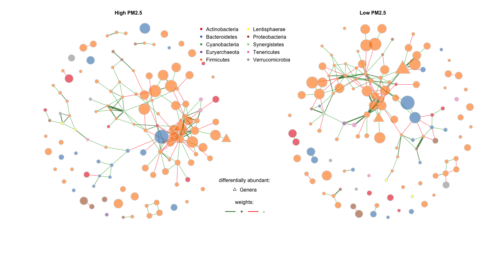
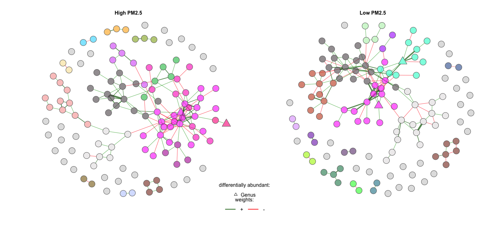
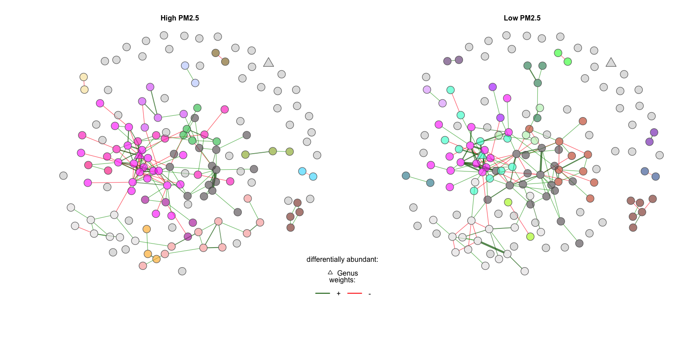
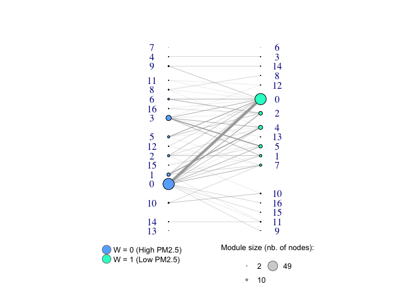

Networks viz Genus (pollution)
================

## NetCoMi

For more details on using the NetCoMi package see
<https://github.com/stefpeschel/NetCoMi>.

## Networks comparison

The following code was run on a cluster.

``` r
# # load phyloseq data
# load('/Users/alicesommer/Desktop/Bureau/DOCTORATE/data_pipeline_microbiome/ps_to_net_Gen.RData')
# 
# gut_split <- metagMisc::phyloseq_sep_variable(ps_Genus_prune, "W")
# 
# net_W <- netConstruct(gut_split$`0`, gut_split$`1`, verbose = 2,
#         # filtTax = "highestVar",
#         # filtTaxPar = list(highestVar = 50),
#                            measure = "spieceasi",
#                           measurePar = list(method = "glasso",
#                                             nlambda=20,
#                                             pulsar.params=list(rep.num=50)),
#                           normMethod = "none", zeroMethod = "none",
#                           sparsMethod = "none", seed = 123456, matchDesign = c(1,1))
# 
# 
# props_W <- netAnalyze(net_W, clustMethod = "cluster_fast_greedy", connectivity = FALSE)
# save(props_W, file = "/Users/alicesommer/Desktop/Bureau/DOCTORATE/data_pipeline_microbiome/props_W_Gen.RData")
```

    ## Taxonomy Table:     [3 taxa by 7 taxonomic ranks]:
    ##        Kingdom    Phylum       Class        Order           Family           
    ## Seq876 "Bacteria" "Firmicutes" "Clostridia" "Clostridiales" "Lachnospiraceae"
    ## Seq11  "Bacteria" "Firmicutes" "Clostridia" "Clostridiales" "Lachnospiraceae"
    ## Seq137 "Bacteria" "Firmicutes" "Clostridia" "Clostridiales" "Ruminococcaceae"
    ##        Genus            Species
    ## Seq876 "Marvinbryantia" NA     
    ## Seq11  "Blautia"        NA     
    ## Seq137 "Anaerotruncus"  NA

We plot the results of the netAnalyze function.

``` r
phyl_ps_prune <- as.factor(tax_table(ps_Genus_prune)[, 'Phylum'])
names(phyl_ps_prune) <- rownames(tax_table(ps_Genus_prune)[, 'Phylum'])
phylcol <- c(brewer.pal(9, "Set1")[1:7], brewer.pal(9, "Greens")[4], brewer.pal(9, "Set1")[8:9])

phylcol_names <- phylcol[phyl_ps_prune]
names(phylcol_names) <- rownames(tax_table(ps_Genus_prune)[, 'Phylum'])

set.seed(1)

shapeVec <- rep(1, ncol(otu_table(ps_Genus_prune)))
shapeVec[c(116,5,47)] <- 2
names(shapeVec) <- names(phyl_ps_prune)

plot_props <- plot(props_W, 
     layout = "spring",
     sameLayout = TRUE, layoutGroup = 1, 
     labels = FALSE,
     # labelScale = TRUE,
     # featVecCol = phyl_ps_prune,
     nodeColor = "colorVec",
     colorVec = phylcol_names,
     nodeTransp = 20,
     borderCol = "gray40", highlightHubs = FALSE, 
     nodeSize = "clr", cexNodes = .5, 
     # cexNodes = 1, 
     # nodeSizeSpread = 3,
     cexTitle = 2,
     edgeTranspLow = 30, 
     edgeTranspHigh = 30,
     # nodeShape = c("circle", "triangle","square","diamond"),
     nodeShape = c("circle", "triangle"),
     featVecShape = shapeVec,
     rmSingles = "inboth",
     mar = c(6,5,3,2), groupNames = c("Polluted air", "Clean air"))
legend("top", 
       inset = .05, title = "phylum:",
       legend=levels(phyl_ps_prune), ncol = 2,
       col=phylcol, pt.bg = phylcol, bty = "n", pch=16) 
legend("bottom", 
       inset = .13, 
       title = "weights:",
       legend=c("+","-"), lty = 1, lwd = 2,
       col=c("darkgreen","red"), bty="n", horiz = TRUE) 
legend("bottom", 
       inset = .19, 
       title = "differentially abundant:",
       legend=c("Genus"), 
       pch = c(2,0,5), 
       bty="n", horiz = FALSE) 
```

<!-- -->

## Network properties

``` r
summary(props_W)[[1]]
```

    ##                                group '1' group '2'
    ## Number of connected components   8.00000  10.00000
    ## Clustering coefficient           0.36027   0.29231
    ## Moduarity                        0.60138   0.61070
    ## Positive-to-negative ratio       2.38776   2.29167
    ## Edge density                     0.01506   0.01433
    ## Natural connectivity             0.00792   0.00780

### Modularity (clusters/modules)

``` r
# summary(props_W)
```

#### Vizualisation

``` r
nclust_1 <- max(as.numeric(names(table(props_W$clustering$clust1))))+1
nclust_2 <- max(as.numeric(names(table(props_W$clustering$clust2))))+1
nclust <- nclust_1 + nclust_2
col <- sample(polychrome(nclust))

set.seed(13)
plot_cluster <- plot(props_W,
     layout = "spring",
     # sameLayout = TRUE, layoutGroup = 1, 
     labels = FALSE, 
     labelFont = 1, cexLabels = 2,
     nodeColor = "cluster",
     colorVec = col,
     sameColThresh = 4,
     nodeTransp = 40, 
     borderCol = "gray40", highlightHubs = FALSE,
     # nodeSize = "clr", cexNodes = 1, 
     nodeShape = c("circle", "triangle"),
     featVecShape = shapeVec,
     rmSingles = "inboth",
     cexTitle = 2,
     edgeTranspLow = 30, 
     edgeTranspHigh = 30,
     mar = c(6,5,3,2), groupNames = c("Polluted air", "Clean air"))
legend("bottom", 
       inset = .11, 
       title = "weights:",
       legend=c("+","-"), lty = 1, lwd = 2,
       col=c("darkgreen","red"), bty="n", horiz = TRUE) 
legend("bottom", 
       inset = .17, 
       title = "differentially abundant:",
       legend=c("Genus"),  
       pch = c(2,0,5), 
       bty="n", horiz = FALSE) 
```

<!-- -->

#### Shared nodes among modules

``` r
dat_graph <- data.frame(id = names(props_W$clustering$clust1), 
                        com_p = props_W$clustering$clust1,
                        com_c = props_W$clustering$clust2)

dat_graph[,2] <- paste0(dat_graph[,2], "_P")
dat_graph[,3] <- paste0(dat_graph[,3], "_C")

inc_com_sum <- ddply(data.frame(dat_graph), .(com_p, com_c), 
                     summarise, sum = length(id))

g_sum <- graph.data.frame(inc_com_sum[,c(1,2)], directed = F)
V(g_sum)$type <- V(g_sum)$name %in% inc_com_sum[,1] #the first column of edges is TRUE type

# node size represents the number of OTUs in each module
V(g_sum)$com_nr <- unlist(strsplit(V(g_sum)$name, "_"))[c(TRUE,FALSE)]
V(g_sum)$com_size <- rep(NA, length(V(g_sum)$com_nr))
V(g_sum)$com_size[V(g_sum)$type == TRUE] <- table(props_W$clustering$clust1)[V(g_sum)$com_nr[V(g_sum)$type == TRUE]] # control sizes
V(g_sum)$com_size[V(g_sum)$type == FALSE] <- table(props_W$clustering$clust2)[V(g_sum)$com_nr[V(g_sum)$type == FALSE]] # treated sizes

V(g_sum)$color <- V(g_sum)$type
V(g_sum)$color=gsub("FALSE","#1CFFCE",V(g_sum)$color)
V(g_sum)$color=gsub("TRUE","#66B0FF",V(g_sum)$color)
E(g_sum)$weight <- as.numeric(inc_com_sum[,3])

layout_bi_rows <- layout_as_bipartite(g_sum, hgap = 50, vgap = 60, maxiter = 1000)

legend_cats <- data.frame(size_circle = V(g_sum)$com_size/2,
                          size_text = V(g_sum)$com_size)
legend_cats <- legend_cats[order(legend_cats$size_circle), ]
#dim(legend_cats)
legend_cats <- legend_cats[c(1,25,34),]

# order by vertex size
par(mfrow=c(1,1))
plot(g_sum, vertex.size = V(g_sum)$com_size/2, edge.width=E(g_sum)$weight/5, 
     layout=layout_bi_rows[,2:1], vertex.label=V(g_sum)$com_nr,
     vertex.label.dist=5, vertex.label.degree = pi*V(g_sum)$type, 
     margin = -.2, asp = 2, edge.arrow.size=.7)

legend(x=-2.5, y=-1.1, c("W = 0 (Polluted)", "W = 1 (Clean)"), pch=21,
       col="#777777", pt.bg=c("#66B0FF","#1CFFCE"), pt.cex=2, cex=.8, bty="n", ncol=1)

legend(x=.1, y=-1.1, legend=legend_cats$size_text, pt.cex=legend_cats$size_circle/11, bty="n", cex = .8,
       col="#777777", pch=21, pt.bg="lightgray", ncol = 2, y.intersp = 1.5, x.intersp = 1.5, 
       title = "Module size (nb. of nodes):")
```

<!-- -->

#### Big modules structure

``` r
names_clust <- as.character(c(names(props_W$clustering$clust1)[which(props_W$clustering$clust1 %in% c(3))],
                            names(props_W$clustering$clust2)[which(props_W$clustering$clust2 %in% c(4))]))
names_clust <- unique(names_clust)
# labels_phyl <- substr(as.character(phyl_ps_prune[names_clust]), 1, 3)
col_module <- unique(plot_cluster$nodecolor$nodecol1[names_clust],
                     plot_cluster$nodecolor$nodecol2[names_clust])

labels_1 <- unname(tax_table(ps_Genus_prune)[,"Genus"])
labels_1[is.na(labels_1)] <- paste0("Order_", unname(tax_table(ps_Genus_prune)[is.na(labels_1),"Order"]))
labels_1 <- as.character(labels_1)
names(labels_1) <- rownames(tax_table(ps_Genus_prune)[, 'Genus'])

plot(props_W, 
     # sameLayout = TRUE, layoutGroup = 2, 
     repulsion = .8,
     # charToRm = "Seq",
     labels = labels_1[names_clust],
     labelFont = 1, 
     cexLabels = .7,
     labelScale = FALSE,
     # featVecCol = phyl_ps_prune[names_clust],
     nodeColor = "colorVec",
     colorVec = list(phylcol_names[names_clust],
                  phylcol_names[names_clust]),
     sameClustCol = FALSE,
     borderCol = "gray40", highlightHubs = FALSE,
     nodeSize = "clr", cexNodes = 1.5, 
     nodeTransp = 40,
     nodeFilter = "names",
     nodeShape = c("circle", "triangle"),
     featVecShape = shapeVec[names_clust],
     nodeFilterPar = names_clust,
     edgeTranspLow = 30, edgeTranspHigh = 30,
     groupNames = c("Polluted air", "Clean air"))
```

<!-- -->

``` r
tax_table(ps_Genus_prune)[c("Seq46","Seq21","Seq56","Seq517","Seq288","Seq11"),]
```

    ## Taxonomy Table:     [6 taxa by 7 taxonomic ranks]:
    ##        Kingdom    Phylum        Class        Order          
    ## Seq46  "Bacteria" "Firmicutes"  "Clostridia" "Clostridiales"
    ## Seq21  "Bacteria" "Firmicutes"  "Clostridia" "Clostridiales"
    ## Seq56  "Bacteria" "Firmicutes"  "Clostridia" "Clostridiales"
    ## Seq517 "Bacteria" "Firmicutes"  "Clostridia" "Clostridiales"
    ## Seq288 "Bacteria" "Tenericutes" "Mollicutes" "NB1-n"        
    ## Seq11  "Bacteria" "Firmicutes"  "Clostridia" "Clostridiales"
    ##        Family                Genus                           Species
    ## Seq46  "Christensenellaceae" "Christensenellaceae_R-7_group" NA     
    ## Seq21  "Ruminococcaceae"     "Ruminococcaceae_UCG-002"       NA     
    ## Seq56  "Ruminococcaceae"     "Ruminococcaceae_UCG-005"       NA     
    ## Seq517 "Ruminococcaceae"     "Ruminococcaceae_UCG-010"       NA     
    ## Seq288 NA                    NA                              NA     
    ## Seq11  "Lachnospiraceae"     "Blautia"                       NA
