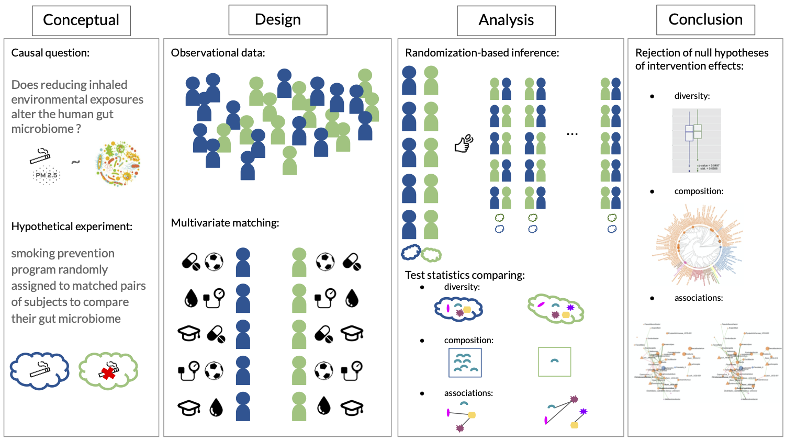

Randomization-based causal inference framework to analyze 16s rRNA gut microbiome data.
=======================================================================================

Framework
---------

Data access
-----------

The KORA cohort study \[[Holle et
al. (2005)](https://pubmed.ncbi.nlm.nih.gov/16032513/)\] data is only
accessible after applying to a research project on the
[KORA-passt](https://epi.helmholtz-muenchen.de) platform.

In the [`microbiome_ASV_data`](microbiome_ASV_data) folder are the
details about the data pre-processing and the data files handed-in after
successful application to a KORA project.

Stage 2: Design
---------------

The R code for our pair matching implementation and diagnostic plots
generation can be found in the [`design`](design) file. The matrix of
10,000 possible randomization of the intervention assignment is also
generated directly after matching.

*Note 1*: the matching functions
[Stephane\_matching.R](misc/Stephane_matching.R) were written in Rcpp by
Stéphane Shao.

*Note 2*: other matching strategies are valid. The researcher should
take the conceptual hypothetical experiment into account when choosing
its strategy.

*Note 3*: to make the matching easier we re-formated/coded the original
KORA variables. See
[`misc/format_KORA_variables.R`](misc/format_KORA_variables.R) file.

Stage 3: Analysis
-----------------

The ASV (or OTU) data table, matched dataset, and phylogenetic tree are
combined in a [phyloseq](https://joey711.github.io/phyloseq/) object
before making statistical analyses. Thus, the following code can be used
for any other data combined in a phyloseq object.

### Diversity

#### Richness and alpha-diversity

R code in [`1_alpha_diversity`](1_alpha_diversity) folder.

We used Amy Willis’ R packages
[`breakaway`](https://github.com/adw96/breakaway) for richness
estimation \[[Willis and Bunge,
2015](https://onlinelibrary.wiley.com/doi/abs/10.1111/biom.12332)\] and
[`DivNet`](https://github.com/adw96/DivNet) for Shannon index estimation
\[[Willis,
2020](https://academic.oup.com/biostatistics/advance-article-abstract/doi/10.1093/biostatistics/kxaa015/5841114)\].

#### Beta-diversity

R code in [`2_beta_diversity`](2_beta_diversity) folder.

The distance calculations where done with the phyloseq package and we
used Anna Plantinga’s R package
[`MiRKAT`](https://cran.r-project.org/web/packages/MiRKAT/index.html)
for the test statistic calculations \[[Zhao et al.,
2015](https://www.ncbi.nlm.nih.gov/pmc/articles/PMC4570290/)\].

### Compostion

#### Compositional equivalence

R code in [`3_mean_diff_test`](3_mean_diff_test) folder.

Cao, Lin, and Li’s github repository:
[`composition-two-sampe-test`](https://github.com/yuanpeicao/composition-two-sampe-test)
\[[Cao, Lin, and Li,
2018](https://academic.oup.com/biomet/article/105/1/115/4591648)\].

#### Differential abundance

R code in [`4_differential_abundance`](4_differential_abundance) folder.

Brill R package: [`dacomp`](https://github.com/barakbri/dacomp) github.

#### Correlation structure

R code in [`5_networks`](5_networks) folder.

Peschel R package: [`NetCoMi`](https://github.com/stefpeschel/NetCoMi)
github.

#### Further analyses (metabolites)

References
----------

\[Holle et al., 2005\] Holle R, Happich M, Löwel H, Wichmann HE (2005);
[MONICA/KORA Study Group. KORA–a research platform for population based
health research.](https://pubmed.ncbi.nlm.nih.gov/16032513/)
*Gesundheitswesen*, 67.

\[Willis and Bunge, 2015\] Willis A and Bunge J (2015); [Estimating
diversity via frequency
ratios.](https://onlinelibrary.wiley.com/doi/abs/10.1111/biom.12332)
*Biometric Methodology*, 71:1042-1049.

\[Willis and Bryan, 2020\] Willis A and Bryan DM (2020); [Estimating
diversity in networked ecological
communities](https://academic.oup.com/biostatistics/advance-article-abstract/doi/10.1093/biostatistics/kxaa015/5841114)
*Biostatistics*, kxaa015.

\[Zhao et al., 2015\] Zhao N, Chen J, Carroll IM, et al. (2015);
[Testing in Microbiome-Profiling Studies with MiRKAT, the Microbiome
Regression-Based Kernel Association
Test.](https://www.ncbi.nlm.nih.gov/pmc/articles/PMC4570290/) *Am J Hum
Genet.*, 96(5):797-807.

\[Cao, Lin, Li, 2018\] Cao, Y., Lin, W. and Li, H. (2018). [Two-sample
tests of high-dimensional means for compositional
data.](https://academic.oup.com/biomet/article/105/1/115/4591648)
*Biometrika*, 105:115-132.
