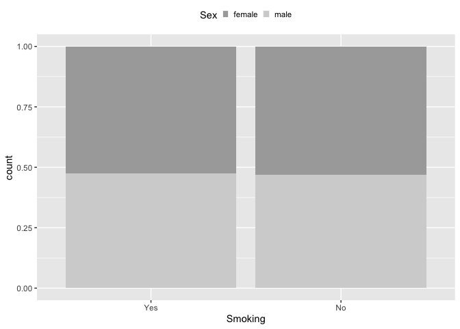

Design stage
================

## American gut data

``` r
load('./agdata.rda')
agdata
```

    ## phyloseq-class experiment-level object
    ## otu_table()   OTU Table:         [ 34491 taxa and 27017 samples ]
    ## sample_data() Sample Data:       [ 27017 samples by 659 sample variables ]
    ## tax_table()   Taxonomy Table:    [ 34491 taxa by 13 taxonomic ranks ]

### Exposure/Intervention

``` r
# grep('smok',colnames(sample_data(agdata)))
colnames(sample_data(agdata))[61]; table(sample_data(agdata)[,61])
```

    ## [1] "smoking_frequency"

    ## 
    ##                                                       Daily 
    ##                          2789                           372 
    ##               LabControl test                         Never 
    ##                           268                         21792 
    ##                  Not provided Occasionally (1-2 times/week) 
    ##                           466                           283 
    ##    Rarely (a few times/month)    Regularly (3-5 times/week) 
    ##                           921                           126

``` r
# keep samples of smoker and never-smoker
agdata_smoke <- prune_samples(sample_data(agdata)$smoking_frequency %in% c('Daily','Never'), agdata)
rm(agdata)

agdata_smoke
```

    ## phyloseq-class experiment-level object
    ## otu_table()   OTU Table:         [ 34491 taxa and 22164 samples ]
    ## sample_data() Sample Data:       [ 22164 samples by 659 sample variables ]
    ## tax_table()   Taxonomy Table:    [ 34491 taxa by 13 taxonomic ranks ]

### Background covariates

``` r
# grep('sex',colnames(sample_data(agdata_smoke)))
# colnames(sample_data(agdata_smoke))[20]
table(sample_data(agdata_smoke)[,20])
```

    ## 
    ##       female         male Not provided  unspecified        other 
    ##        11513        10122          476           35           18

``` r
agdata_smoke <- prune_samples(sample_data(agdata_smoke)$sex %in% c('female','male'), agdata_smoke)

# grep('age_cat',colnames(sample_data(agdata_smoke)))
# colnames(sample_data(agdata_smoke))[309]
table(sample_data(agdata_smoke)[,309])
```

    ## 
    ##                       20s          30s          40s          50s          60s 
    ##          606         1966         3714         3889         4107         3937 
    ##          70+        child Not provided         teen 
    ##         1402          894          628          492

``` r
agdata_smoke <- prune_samples(!sample_data(agdata_smoke)$age_cat %in% c('Not provided','','child','teen'), agdata_smoke)

# grep('bmi',colnames(sample_data(agdata_smoke)))
# colnames(sample_data(agdata_smoke))[109]
summary(sample_data(agdata_smoke)[,109])
```

    ##       bmi_corrected  
    ##  Not provided: 6222  
    ##  25.46       :  289  
    ##  23.09       :   82  
    ##  21.93       :   65  
    ##  21.97       :   60  
    ##  22.96       :   60  
    ##  (Other)     :12237

``` r
agdata_smoke <- prune_samples(!sample_data(agdata_smoke)$bmi_corrected %in% c('Not provided',''), agdata_smoke)

# str(sample_data(agdata_smoke)[,c(20,309,109)])
sample_data(agdata_smoke)$bmi_corrected <- as.numeric(as.character(sample_data(agdata_smoke)$bmi_corrected))
summary(sample_data(agdata_smoke)[,c(20,309,109)])
```

    ##      sex       age_cat    bmi_corrected  
    ##  female:6763   20s:1367   Min.   : 8.58  
    ##  male  :5975   30s:2544   1st Qu.:21.47  
    ##                40s:2584   Median :23.74  
    ##                50s:2665   Mean   :24.66  
    ##                60s:2654   3rd Qu.:26.58  
    ##                70+: 924   Max.   :65.37

## Matching

### prepare the before matching data

``` r
data <- as.data.frame(sample_data(agdata_smoke))

# create the exposure variable
data$W <- NA
data[data$smoking_frequency == "Daily",]$W <- 0 # raucher
data[data$smoking_frequency == "Never",]$W <- 1 # nie-raucher
dim(data)
```

    ## [1] 12738   660

``` r
table(data$W)
```

    ## 
    ##     0     1 
    ##   250 12488

### before matching background covariates plots

``` r
colnames_covs = c("sex", "age_cat", "bmi_corrected")
```

``` r
### Sex 
g_sex <- ggplot(data, aes(x = factor(W), fill = sex)) +
  geom_bar(position = "fill") +
  scale_fill_manual(name = "Sex", values = c('darkgray','lightgray')) +
  scale_x_discrete(name = "Smoking", breaks = c(0,1), labels = c("Yes","No")) +
  theme(legend.position = "top", legend.key.size =  unit(0.1, "in"))
g_sex
```

<!-- -->
