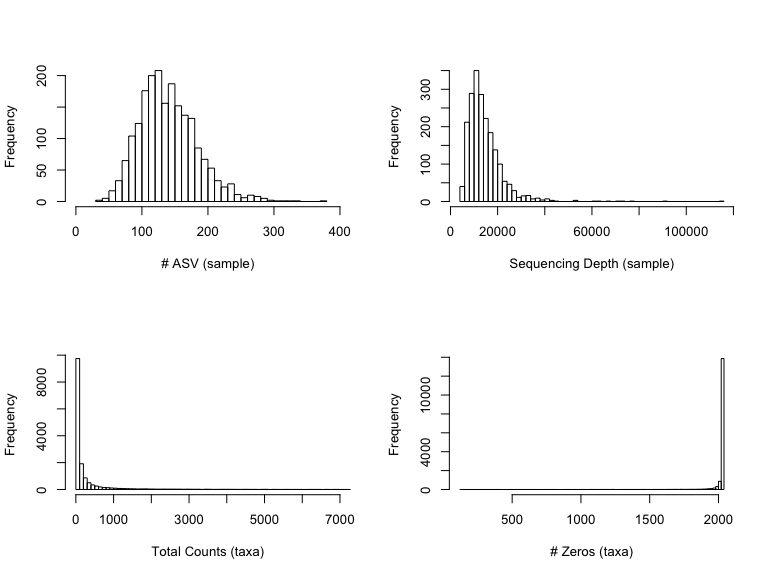
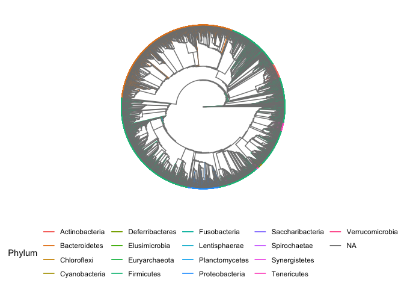

ASV data intro manual
================

## Data collection

DNA Extraction, 16S rRNA Gene Amplification, and Amplicon Sequencing was
done at the Ziel NGS-Core Facility of the Technical University Muenchen
(TUM).

Cite: Reitmeier S, Kiessling S, Clavel T, et al. Arrhythmic Gut
Microbiome Signatures Predict Risk of Type 2 Diabetes. Cell Host
Microbe. 2020;28(2):258-272.e6. <doi:10.1016/j.chom.2020.06.004>

## Data transformation

The demulitplexed, per-sample, primer-free amplicon reads were processed
with the DADA2 workflow
<https://benjjneb.github.io/dada2/tutorial.html>.

See asv\_creation\_KORA\_dada2.R script.

Result: 1. ASV table (seqtab2020.rds); 2. Taxonomic assignment
(taxa2020.rds); 3. Phylogenetic tree (phylotree2020.phy).

Cite: Sommer et al. (TBD)

## Intro to phyloseq data

Important Bioconductor tutorial to work with phyloseq data:
<https://www.bioconductor.org/packages/devel/bioc/vignettes/phyloseq/inst/doc/phyloseq-analysis.html>

Details about phyloseq structure: McMurdie PJ, Holmes S. phyloseq: an R
package for reproducible interactive analysis and graphics of microbiome
census data. PLoS One. 2013;8(4):e61217. Published 2013 Apr 22.
<doi:10.1371/journal.pone.0061217>

``` r
library(phyloseq)
library(ggplot2)
library(ggtree)
```

### load the data

``` r
# set working directory
setwd('/Users/alicesommer/Desktop/Bureau/DOCTORATE/data_pipeline_microbiome')

# load microbiome data
ASV_table <- readRDS('dada2output/seqtab2020.rds')
taxon_assign <- readRDS('dada2output/taxa2020.rds')
# load phylogenetic information
load("dada2output/phylotree2020.phy")
```

### create a phyloseq object

``` r
ps <- phyloseq(otu_table(ASV_table, taxa_are_rows=FALSE),
               #sample_data(sample_df), ## here you can add the KORA variables from your PV
               tax_table(taxon_assign),
               phy_tree(tGTR$tree))
ps
```

    ## phyloseq-class experiment-level object
    ## otu_table()   OTU Table:         [ 15801 taxa and 2034 samples ]
    ## tax_table()   Taxonomy Table:    [ 15801 taxa by 7 taxonomic ranks ]
    ## phy_tree()    Phylogenetic Tree: [ 15801 tips and 15799 internal nodes ]

### plot summary statistics of the ASV data

``` r
par(mfrow=c(2,2))

## nr. of ASV present
locate_ASV_in_sample <- apply(otu_table(ps), 1, function(x) sum(x != 0))
hist(locate_ASV_in_sample, breaks = 30, main = "", xlab = "# ASV (sample)", xlim = c(0,400))

## sequencing depth (count statistics accross each n)
hist(sample_sums(ps), breaks = 50, main = "", xlab = "Sequencing Depth (sample)")
# min(sample_sums(ps))

## count statistics accross each p
hist(taxa_sums(ps), breaks = 7000, main = "", xlab = "Total Counts (taxa)", xlim=c(1,7000))

## zero dist accross each p
zero_p <- apply(otu_table(ps), 2, function(x) sum(x == 0))
hist(zero_p, breaks = 100, main = "", xlab = "# Zeros (taxa)")
```

<!-- -->

### apply function on every row of taxa table

``` r
locate_NA_taxa <- apply(taxon_assign, 1, function(x) sum(is.na(x)))
table(locate_NA_taxa)
```

    ## locate_NA_taxa
    ##     0     1     2     3     4     5     6 
    ##   468 12177  2573   538    26     9    10

### plot a phylogenetic tree

``` r
tree_big <- ggtree(ps, aes(color=Phylum), branch.length='none', layout = "circular")
tree_big <- tree_big + theme(legend.position="bottom")

tree_big
```

<!-- -->
